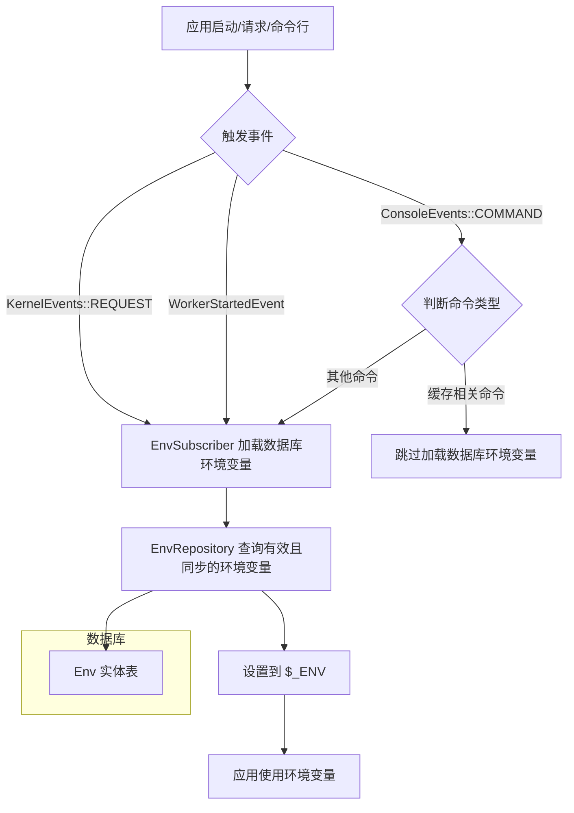

# EnvManageBundle 工作流程（Mermaid）

## 说明

- EnvSubscriber 监听 Symfony 的关键事件，在 HTTP 请求、消息队列 Worker 启动、命令行执行前加载数据库中的环境变量。
- 只加载有效（valid=true）且需要同步（sync=true）的变量。
- 某些命令（如缓存清理等）会跳过加载。
- 环境变量最终写入 $_ENV，供应用后续流程使用。
